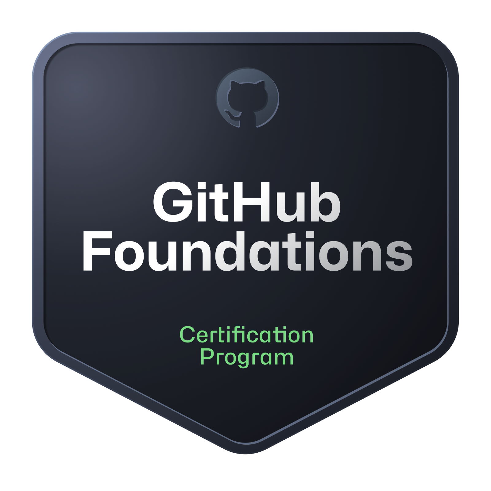
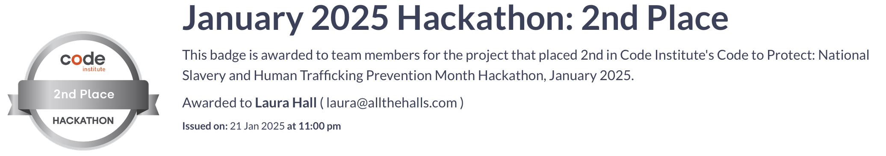

# 👋 Hiya,  I'm Laura!

🚀 **Junior Full-Stack Software Developer**  
📍 Based in Preston, UK  

 

---

### About Me
I'm a **career changer** with a diverse background in education and a passion for **technology**. 

I thrive on learning new technologies, tackling complex challenges, and collaborating with dynamic teams to build innovative solutions. Currently, I'm honing my skills in **full-stack development** with a focus on the fundamentals.

---

### 💻 Technical Skills
- **Frontend:**  , ,  ,  
- **Backend:**  ,
- **UX Design:**  , , , 
- **Tools & Methodologies:**  ,  ,  ,  ,  , 
 ,  , 
- **Accessibility & Responsivity:**
 , 
 , 
- **AI:**

    

 
---

### 🔍 Portfolio Projects
- **[Chain Breakers](https://github.com/trxdave/chain-breaker1):**  
  A website built for a hackathon that focuses on interactive trafficking scenarios designed to raise awareness and educate users about the warning signs of human trafficking.

    

- **[Merry Taskmas](https://github.com/laurachri-hall/merrytaskmas):**  
  A holiday planner with CRUD functionality, built with Python and Django during a hackathon.
  
- **[LitRPG Library](https://github.com/laurachri-hall/LitRPG-Library):**  
  A book review site for the LitRPG genre, utilizing Django and a clean, user-friendly interface.
  
- **[Kana Kards](https://github.com/laurachri-hall/kana-kards):**  
  An interactive game to learn Japanese hiragana, featuring audio integration and dynamic flashcards in JavaScript.
  
- **[Board Game Guardians](https://github.com/laurachri-hall/project-1-safeguarding-bgg):**  
  A static website for a community group, emphasizing accessibility and safeguarding.

---

### 🌱 Currently Learning
I'm focused on:
- **Python Basics**: Strengthening my understanding of Python fundamentals, including scripting, problem-solving, and coding best practices.
- **AI Exploration**: Learning about the basics of artificial intelligence and how Python can be applied in this field.
- **Collaborative Development:** Joining **hackathons** and small team projects to practice real-world Agile workflows and build team-oriented coding solutions.

---

### 📊 GitHub Stats
  
  

---

### 🎖️ Achievements

---

### 📚 Interests
- **LitRPG Books:** Always looking for book recommendations (any genre accepted!)!
- **Board Games & Tabletop RPGs:** A passionate (board) gamer and story enthusiast.
- **Sports:** Enjoy badminton and swimming.

---

### 📩 Let's Connect!
I'm always eager to collaborate, learn, and contribute to meaningful projects. Feel free to reach out!

---
*"Empowering individuals through technology and learning, one project at a time."* 🚀

